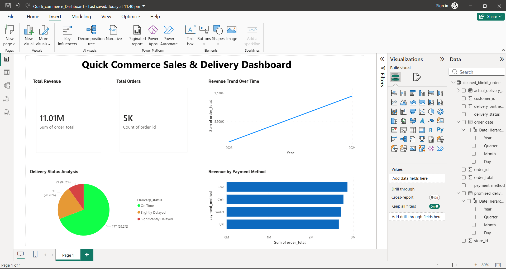

# Quick Commerce Analytics Dashboard

## Project Overview
An end-to-end business analytics project built using Python, MySQL, and Power BI to analyze quick-commerce sales and delivery operations.

## Tools & Technologies
- Python
- Pandas
- NumPy
- MySQL
- Power BI
- Google Colab

## Features
- Data Cleaning & EDA
- SQL Analytics Queries
- KPI Dashboard
- Revenue Trend Analysis
- Delivery Status Insights
- Payment Method Analysis

## Dashboard Preview

## Author
SaiSohangoud
